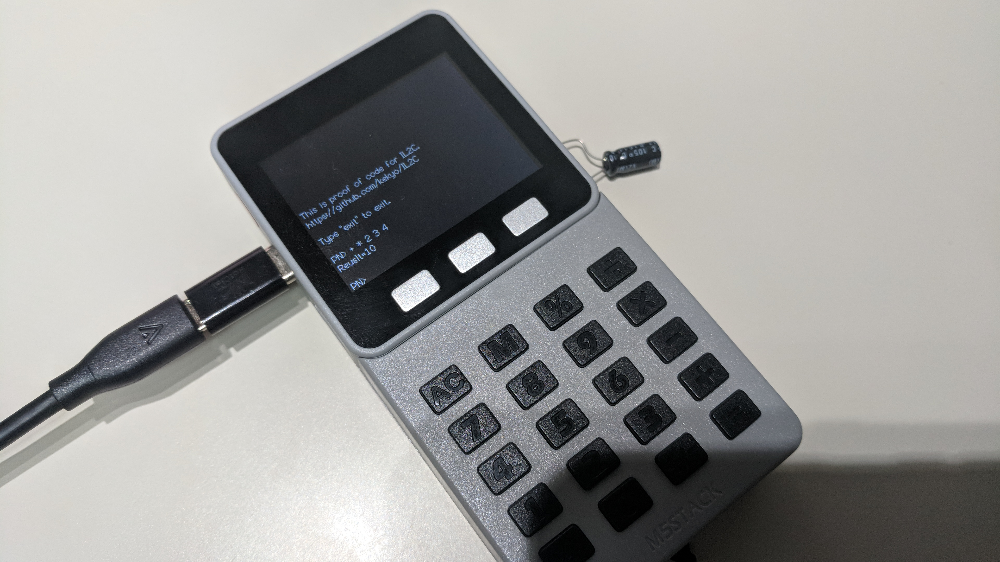
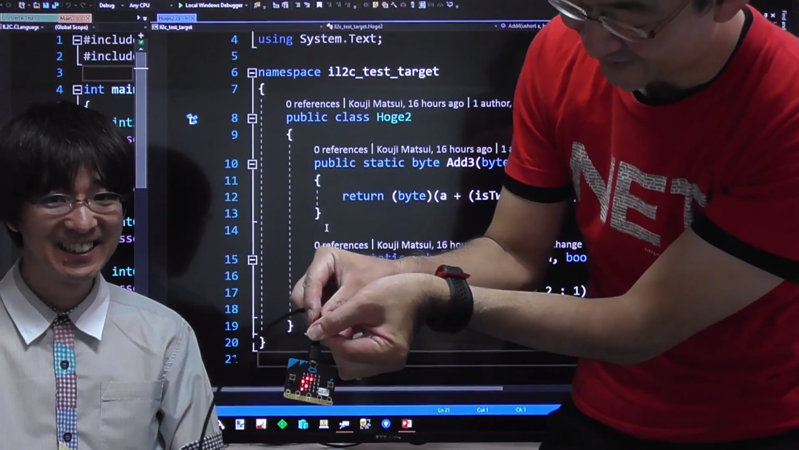

# IL2C - A translator implementation of .NET intermediate language to C language.

|Provider|Build|Tests|
|:--|:--|:--|
|AppVeyor master|[](https://ci.appveyor.com/project/kekyo/il2c/branch/master)|[](https://ci.appveyor.com/project/kekyo/il2c/branch/master/tests)|

## What's this?

* IL2C is a translator implementation of .NET intermediate language to C language, and the project for step-by-step designing and video recording.

* IL2C's implementation priorities:
  * Better predictability for runtime cost.
  * Better code portability.

* Public YouTube recorded videos: ["Making archive IL2C play list"](http://bit.ly/2xtu4MH)
  * "How to create IL2C or same tool of IL2CPP? This video contains pure design process through concept and details."

## Very simple translation sample

Original C# source code:

```csharp
namespace il2c_test_target
{
    public class Hoge1
    {
        public static int Add1(int a, bool isTwo)
        {
            return a + (isTwo ? 2 : 1);
        }
    }
}
```

Translate to C by [Milestone 3 version](https://github.com/kekyo/IL2C/commit/d94582a330fbb1aa0d62e73bc78344559abce3c2):

```c
int32_t il2c_test_target_Hoge1_Add1(int32_t a, bool isTwo)
{
    int32_t local0;

    int32_t __stack0_0;
    int32_t __stack1_0;

    __stack0_0 = a;
    __stack1_0 = isTwo ? 1 : 0;
    if (__stack1_0 != 0) goto L_0000;
    __stack1_0 = 1;
    goto L_0001;
L_0000:
    __stack1_0 = 2;
L_0001:
    __stack0_0 = __stack0_0 + __stack1_0;
    local0 = __stack0_0;
    goto L_0002;
L_0002:
    __stack0_0 = local0;
    return __stack0_0;
}
```

## License

Under Apache v2.

## Overall status

### These list are auto-generated by unit test.

* [Supported IL opcodes list](supported-opcodes.md)

* [Supported runtime types](supported-runtime-types.md)

* [Supported type-system features](supported-typesystem-features.md)

### These list are manually maintanance (and maybe older...)

#### Support basic types

| Issue | Status | Milestone
|:---|:---|:---|
| Value types | Partial supported | M3
| Class types | Partial supported |
| Managed reference | Partial supported | M3
| Unmanaged pointer |
| Enum types |
| Delegate types |
| Interface types | Partial supported |
| Nested types |
| Class inherits | Partial supported |
| Interface implements | Partial supported |
| Array types |
| Multi dimensional array types |
| Closed generic types |
| Open generic types | (not support) | -

#### Support type members

| Issue | Status | Milestone
|:---|:---|:---|
| Static field | Partial supported | M3
| Instance field | Partial supported | M3
| Static method | Partial supported | M3
| Instance method | Partial supported | M3
| Virtual method (class) | Supported |
| Virtual method (interface) | Partial supported |
| Interop method (extern static) | Partial supported |
| Internal method (internal call) |
| Constructor | Partial supported |
| Constructor (ValueType) | Partial supported | M3
| Type initializer |
| Static property |
| Instance property |
| Static event |
| Instance event |

#### Support metadata handling

| Issue | Status | Milestone
|:---|:---|:---|
| Value type scopes | Partial supported | M3
| Class type scopes | Partial supported |
| Enum type scopes |
| Delegate type scopes |
| Interface type scopes | Partial supported |
| Nested type scopes |
| Field scopes | Partial supported | M3
| Method scopes | Partial supported | M3
| Property scopes |
| Event scopes |
| Can handle reflection | (not support) | -

#### Support runtime relates

| Issue | Status | Milestone
|:---|:---|:---|
| Referenced instance handler | Partial supported | 
| Value type boxed instance handler | Partial supported |
| Collect unused instance (GC) | Partial supported |
| Heap compaction (GC) |
| Monitor lock features |
| Platform invoke (P/Invoke) | Partial supported |
| Can handle unsafe pointers |
| Can handle marshaling features (Marshal) |

#### Application lifecycle managements

| Issue | Status | Milestone
|:---|:---|:---|
| Basic commandline driver | Partial supported | M2
| MSBuild (old/Task handler) |
| MSBuild (new/.NET Core CLI) |
| Platform independent core library |
| Host platform on .NET 4.5 | Supported | M1
| Host platform on .NET Core 1 | (not support) | -
| Host platform on .NET Core 2 | Supported |
| Host platform on mono |
| Support C99 compilers | Supported | M1
| Support non C99 (ANSI) compilers | Supported |
| Support better C code output via C++ symbol declarations |
| Support continuous integrations | Partial supported |

## Related informations

* Polish notation calculator project for IL2C proof of concept
  * [Minimum, but useful impls for "Win32", "UEFI" and "M5Stack(ESP32)"](samples/Calculator)
  * 

* Center CLR video letter: "Tested IL2C on micro:bit and arduino platform #8"
  * [](http://bit.ly/2xGFo9J)

* Public conference session video: "Making archive IL2C #6-28 at .NET Conf 2017 Tokyo"
  * [.NET Conf 2017 in Tokyo Room B (In japanese)](https://csugjp.connpass.com/event/66004/)
  * [YouTube video](http://bit.ly/2hI1jTb)

* Milestone 2+ informations included the book of "Extensive Xamarin - Techbook Fest part 3"
  * [Extensive Xamarin - Xamaritans (In japanese)](http://bit.ly/2ycNVzW)

* Public conference session: "Making archive IL2C #6-51 at .NET 600"
  * [.NET 600 conference (In japanese)](https://centerclr.connpass.com/event/71414/)
  * [YouTube video](http://bit.ly/2DiaoKZ)
  * [Slide](https://www.slideshare.net/kekyo/write-common-run-anywhere)

* Public conference session: "How to make the calculator at .NET Fringe Japan 2018 / Making archive IL2C #6-52"
  * [.NET Fringe Japan 2018 New Year Party (In Japanese)](https://dotnetfringe-japan.connpass.com/event/74536/)
  * [Slide](https://www.slideshare.net/kekyo/how-to-make-the-calculator)

* Public conference session: "Making archive IL2C #6-53 at MVP Summit F# Meetup / SEATTLE F# USERS GROUP"
  * [MVP Summit F# Meetup / F# Seattle User Group](https://www.meetup.com/en-US/FSharpSeattle/events/247905452/)
  * [Slide](https://www.slideshare.net/kekyo/mvp-summit-f-meetup-making-archive-il2c-653)

* Public conference session: "Making archive IL2C #6-54 at MVP SUMMIT – VS HACKATHON"
  * [Microsoft MVP Global Summit 2018](https://mvp.microsoft.com/en-us/Summit/Agenda)
  * [Slide](https://www.slideshare.net/kekyo/making-archive-il2c-654-at-mvp-summit-2018-vs-hackathon)

## Took pictures on design process

* #6-6: Near milestones

  

* #6-14: Data flow analysis

  

* Milestone 1: Tested on VC++ and we checked how C compiler's optimizer work.

  

* #6-48: How works mark-and-sweep garbage collection on translated code.

  

* How to do overload/override/virtual method symbol calculus.

  
