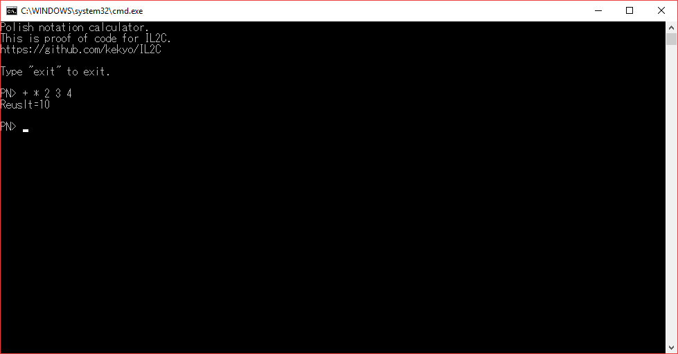

# Polish notation calculator project for IL2C proof of concept

## What's this?

* These are sample code for IL2C.

## The core

* "Calculator.Code" is a proof of concept for polish-notation based calculator code library written by C#.
* It's very neutral implementation, not included any platform dependent code.
* Target platform is .NET Standard 1.3, but IL2C can't understand external libraries currently :)

## The rule for unit tests

* "Calculator.Code" already independent. So we can test this library with standard .NET test technics.
* The "Calculator.Code.Tests" project contains same test code using for NUnit library.

## Platform implementations

* IL2C translated to c language code and stored to "Generated" directory.

### Windows

* "Calculator.Win32" can execute directly on Windows.
* It contains platform-dependent glue functions.
  * Bypass from-to Windows console used for standard c runtime functions.
  * fgetws, wprintf, fwprintf.

### UEFI

* "Calculator.UEFI" can execute directly on UEFI platform.
  * Exactly, this code absolutely contains non-OSes, can boot up from USB flash memory :)
* It contains platform-dependent glue functions.
  * Bypass from-to UEFI console service functions.
  * ConIn, ConOut, OutputString, WaitForEvent, WaitForKey, ReadKeyStroke.

### M5Stack

* "Calculator.M5Stack" can execute directly on [M5Stack with calculator FACES module.](http://m5stack.com/)
  * Exactly, this code absolutely contains non-OSes, it's firmware-level programming :)
* It contains platform-dependent glue functions.
  * Bypass from-to display module (ILI9341) on SPI and Calculator-FACES keyboard (custom AVR) on I2C.
  * M5_Terminal, i2c_keyboard_read

